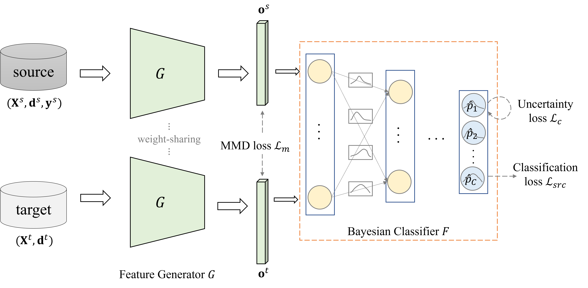

# Bayesian Joint Adaptation Network for Crop Mapping in the Absence of Mapping Year Ground-truth Samples

PyTorch implementation of  ["Bayesian Joint Adaptation Network for Crop Mapping in the Absence of Mapping Year Ground-truth Samples"](https://ieeexplore.ieee.org/document/10633734/?arnumber=10633734)




**Abstract:** Crop mapping is a fundamental step for various higher-level agricultural applications, such as crop yield prediction, farm management analysis, and agricultural market regulation. Recent advancements in deep learning models have greatly promoted crop mapping using satellite imagery time series (SITS), enabling frequent and extensive monitoring of croplands. However, a classifier trained on a specific source year(s) can exhibit reduced effectiveness when directly applied to a different target year(s) due to the inter-annual variation in image signals and crop growth dynamics. To address this issue, we propose an unsupervised domain adaptation method named Bayesian Joint Adaptation Network (BJAN), which aims to align the joint distributions of input SITS and output crop types across different years, thereby facilitating crop mapping in years without ground-truth samples. In the proposed BJAN method, Bayesian uncertainty is used to detect target data that are out the support of the source domain. By minimizing the uncertainty on target samples, the model is trained to align the task-specific conditional distributions of source and target domains. Simultaneously, by constraining the feature distributions of source and target domains, the discrepancy of data-related marginal distributions is alleviated. We conducted experiments for mapping main crops on six geographically dispersed counties in the U.S., where the variation within the dataset further exacerbated the difficulty of cross-year adaptation. The results demonstrated that the proposed method has effectively aligned source and target domains and outperforms several state-of-the-art domain adaptation methods by 6.69% in average OA and 0.085 in average macro F1 scores. 

## Requirements

* Pytorch 3.8.12, PyTorch 1.11.0, and more in `environment.yml`

## Usage

Setup conda environment and activate

```
conda env create -f environment.yml
conda activate py38
```

Set `DATAPATH` in `train_supervised.py` or `train.py` to your data path. 

Example: pre-training in 2019, directly applying to 2020

```shell
python train_supervised.py --source All_2019 --target All_2020
```

use BJAN to adapt from 2019 to 2020

```shell
python train.py --source All_2019 --target All_2020 bjan --weights results\checkpoints\DLTAE_all_2019
```

use BJAN to adapt from 2019 to 2020 (in-season)

```shell
python train.py --source All_2019 --target All_2020 --inseason 8 bjan --weights results\checkpoints\DLTAE_all_2019
```

## Reference

In case you find BJAN or the code useful, please consider citing our paper using the following BibTex entry:

```
@ARTICLE{10633734,
  author={Xu, Yijia and Ebrahimy, Hamid and Zhang, Zhou},
  journal={IEEE Transactions on Geoscience and Remote Sensing}, 
  title={Bayesian Joint Adaptation Network for Crop Mapping in the Absence of Mapping Year Ground-Truth Samples}, 
  year={2024},
  volume={62},
  number={},
  pages={1-20},
  keywords={Crops;Feature extraction;Bayes methods;Data models;Adaptation models;Training;Uncertainty;Bayesian uncertainty;crop mapping;joint distribution;remote sensing (RS);unsupervised domain adaptation (UDA)},
  doi={10.1109/TGRS.2024.3442171}}
```

## Credits

- The implementation of LTAE is based on [the official implementation](https://github.com/VSainteuf/lightweight-temporal-attention-pytorch)
- The implementation of comparison methods is based on [Transfer Learning Library](https://github.com/thuml/Transfer-Learning-Library);  and TimeMatch on [its official implementation](https://github.com/jnyborg/timematch))
